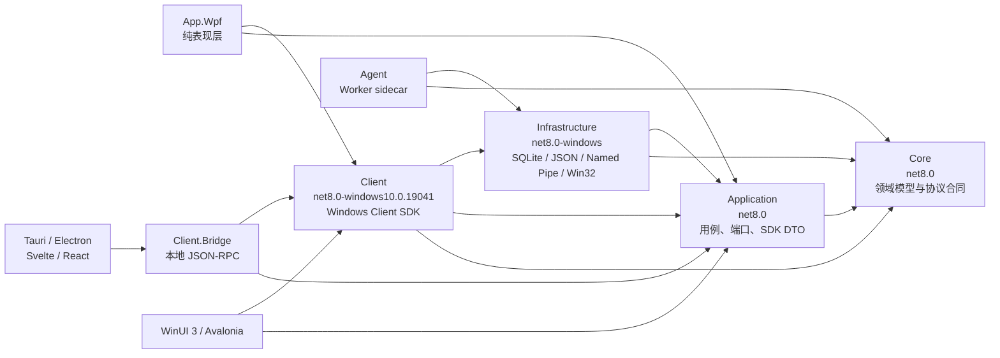

# WUJI Application / Client SDK 抽取方案

日期：2026-07-16  
状态：待实施  
适用范围：`QuantifiedSelf.Windows.Core`、`Infrastructure`、`Agent`、`App`

## 1. 结论与目标

当前 `Core + Infrastructure + Agent` 已经可以作为无 WPF 的 Windows 无头基础层，但 `QuantifiedSelf.Windows.App` 仍同时承担：

- WPF View、主题、窗口、托盘和 Dispatcher；
- Agent 启停、状态查询、IPC 与文件 fallback；
- 设置读写、SQLite 查询编排、统计与洞察计算；
- 应用启动参数、登录自启、刷新协调；
- ViewModel 和图表适配。

本方案的目标是抽取两个稳定边界：

1. `QuantifiedSelf.Windows.Application`：框架无关的应用用例、端口和 DTO；
2. `QuantifiedSelf.Windows.Client`：面向 Windows 前端的 Client SDK，实现进程、IPC、文件、注册表和 Infrastructure 组装。

抽取完成后，WPF App 只负责表现层：View、ViewModel、图表/主题、窗口、托盘、导航、对话框和 UI 线程调度。WinUI 3 或 Windows 上的 Avalonia 可以直接引用 Client SDK；Tauri/Electron 通过本地 Bridge 调用同一套 SDK。

这次架构调整不改变以下产品约束：

- Agent 继续作为独立 sidecar 进程；
- SQLite 数据格式、配置文件路径、runtime/health 文件和 Named Pipe 协议保持兼容；
- Named Pipe 失败时继续使用文件 fallback；
- 默认启动仍创建 `LegacyMainWindow`；
- preview UI 仍只通过 `--channel dev --ui-preview` 启动；
- 不在本次抽取中推广 preview shell，也不迁移生产数据。

## 2. 非目标

第一轮抽取不做以下事情：

- 不把 Agent 改成 Windows Service；
- 不立即实现 macOS/Linux 采集；
- 不替换 SQLite、Named Pipe 或现有 Agent 状态机；
- 不重写当前 WPF 页面；
- 不在 Application 层引入 LiveCharts、Skia、WPF、WinUI、Avalonia 或 WebView 类型；
- 不要求第一阶段就交付 Tauri/Electron 前端；
- 不把 UI 文本、主题 token、可见性和画刷对象放入 SDK。

## 3. 目标依赖结构



### 3.1 强制依赖规则

最终状态必须满足：

- `Core` 不引用任何其他 WUJI 项目；
- `Application` 只引用 `Core`；
- `Infrastructure` 可以引用 `Core + Application`，实现 Application 定义的端口；
- `Client` 引用 `Core + Application + Infrastructure`，但不引用任何 UI 框架；
- `Agent` 不引用 `App`、`Client` 或 UI 框架；
- `App` 只引用 `Application + Client`，不直接引用 `Infrastructure` 或 `Agent`；
- 最终应移除 App 对 Agent 的 `ReferenceOutputAssembly="false"` 引用，App/Agent 的发布顺序由 solution 和 `publish.ps1` 负责；
- `Application` 和 `Client` 的公开 API 中禁止出现 `System.Windows.*`、`System.Windows.Forms.*`、LiveCharts、Skia、`Dispatcher`、`Brush`、`Visibility`、`IValueConverter`、ViewModel 类型。

允许 `Client` 保持 Windows-only，因为它封装 Windows 进程、SID、Named Pipe、注册表和发布目录约定。真正跨平台的业务合同放在 `Application`。

## 4. 新项目职责

### 4.1 QuantifiedSelf.Windows.Application

建议目标框架：`net8.0`。

建议目录：

```text
src/QuantifiedSelf.Windows.Application/
  Abstractions/
    Agent/
    Data/
    Settings/
    Startup/
    Time/
  Contracts/
    Agent/
    Activity/
    Diagnostics/
    Settings/
    Maintenance/
  Features/
    AgentControl/
    Activity/
    Diagnostics/
    Insights/
    Settings/
  Refresh/
  DependencyInjection/
```

职责：

- 定义前端可调用的应用用例；
- 定义对 SQLite 查询、状态存储、IPC、进程和设置存储的端口；
- 提供框架无关、可序列化的 SDK DTO；
- 保留 IPC-first/file-fallback、状态汇总、刷新去重、统计和洞察规则；
- 统一 CancellationToken、错误码、超时和安全错误信息；
- 不创建具体数据库、Named Pipe、Process、Registry 或 UI 对象。

### 4.2 QuantifiedSelf.Windows.Client

建议目标框架：`net8.0-windows10.0.19041`。

建议目录：

```text
src/QuantifiedSelf.Windows.Client/
  Agent/
    WindowsAgentProcessController.cs
    AgentExecutableLocator.cs
  Ipc/
    NamedPipeAgentTransportAdapter.cs
  Settings/
  Startup/
    RegistryStartupRegistry.cs
    StartupCommandBuilder.cs
  Composition/
    WujiClientOptions.cs
    WujiClientFactory.cs
    ServiceCollectionExtensions.cs
  WujiClient.cs
```

职责：

- 提供供 .NET 前端直接使用的 Client SDK；
- 创建 `WindowsAgentPaths`、Infrastructure stores/query adapters、Named Pipe client；
- 获取当前用户 SID 和 runtime channel；
- 定位、启动、检查和停止 Agent 进程；
- 实现登录自启注册；
- 为 Application 端口提供 Windows 实现；
- 暴露一个稳定 facade，避免前端依赖 Infrastructure 具体类。

Client 禁止依赖 WPF/WinForms。托盘、窗口、主题、Dispatcher 仍由各 UI 项目实现。

### 4.3 可选 QuantifiedSelf.Windows.Client.Bridge

建议目标框架：`net8.0-windows`，输出独立 headless executable。

职责：

- 托管 `IWujiClient`；
- 通过当前用户专属 Named Pipe 或 stdin/stdout 提供版本化 JSON-RPC；
- 为 Tauri/Electron 暴露与 .NET Client SDK 等价的操作；
- 绝不返回 SID、完整本地路径、原始异常、注册表原值或未清洗窗口标题；
- 不直接包含业务规则，仅做协议、序列化、鉴权和生命周期桥接。

首选传输是当前用户专属 Named Pipe。若使用 localhost HTTP，必须使用随机端口、每次启动随机 secret、严格 Origin 校验和 loopback-only 监听，不能开放无认证固定端口。

## 5. Client SDK 公共 API

不建议让前端直接 new 一组 service。Client 应提供组合 facade，同时保留按功能拆分的窄接口。

```csharp
public interface IWujiClient : IAsyncDisposable
{
    IAgentClient Agent { get; }
    IActivityClient Activity { get; }
    ISettingsClient Settings { get; }
    IDiagnosticsClient Diagnostics { get; }
    IStartupClient Startup { get; }

    Task InitializeAsync(CancellationToken cancellationToken = default);
}
```

### 5.1 Agent API

```csharp
public interface IAgentClient
{
    Task<AgentStatusSnapshot> GetStatusAsync(CancellationToken cancellationToken = default);
    Task<AgentProcessInfo> StartAsync(CancellationToken cancellationToken = default);
    Task<AgentCommandResult> PauseAsync(CancellationToken cancellationToken = default);
    Task<AgentCommandResult> ResumeAsync(CancellationToken cancellationToken = default);
    Task<AgentCommandResult> StopAsync(CancellationToken cancellationToken = default);
    Task<AgentCommandResult> ReloadConfigAsync(CancellationToken cancellationToken = default);
    Task<AgentCommandResult> PruneDataAsync(CancellationToken cancellationToken = default);
    Task<AgentCommandResult> ClearHistoryAsync(CancellationToken cancellationToken = default);
}
```

第一阶段不让 SDK 在内部持有 UI timer。状态轮询仍由具体 UI 调度，并在返回后切换到自己的 UI 线程。后续如需统一订阅，可增加不捕获 SynchronizationContext 的：

```csharp
IAsyncEnumerable<AgentStatusSnapshot> WatchStatusAsync(
    TimeSpan interval,
    CancellationToken cancellationToken = default);
```

### 5.2 Activity API

建议至少覆盖：

- Dashboard/overview；
- 今日统计；
- Samples 分页查询；
- Sessions 分页查询；
- Apps 使用统计；
- 日期×小时 heatmap；
- 周趋势；
- Focus/interruptions insights。

所有返回值使用 Application DTO 或 Core 的稳定领域模型，不返回 DataGrid row、chart series、brush、tooltip 或 ViewModel。

### 5.3 Settings、Diagnostics 和 Startup API

- Settings 返回规范化设置和验证结果；
- 保存设置时由 Application 统一执行校验；
- Diagnostics 只返回安全、结构化字段；
- Startup 返回 `Enabled/Disabled/Mismatch/Unsupported/Error` 等结构化状态；
- UI 负责把状态转换成中文展示文案和按钮可用性。

### 5.4 DTO 规则

SDK DTO 必须：

- 使用普通 class/record、数组或 `IReadOnlyList<T>`；
- 使用 `DateTimeOffset` 或明确为 UTC 的 `DateTime`；
- 带协议/契约版本；
- 使用稳定枚举和 error code；
- 可被 `System.Text.Json` 序列化；
- 不包含 `ObservableCollection`、`ICommand`、UI color/brush、framework control；
- 不包含原始 exception；
- 不把格式化后的 PID、日期、时长字符串作为唯一数据源；UI 可以基于原始值格式化。

## 6. Application 端口设计

Application 不能 new Infrastructure 具体类。建议增加以下端口：

```text
IAgentTransport             发送 Agent IPC 请求
IAgentControlFallbackStore  读写控制文件 fallback
IRuntimeStateReader         读取 runtime_state
IAgentHealthStateReader     读取 health_state
IAgentProcessController     启动、检查、停止 Agent 进程
IAppSettingsStore           AppSettings 读写
IAgentOptionsStore          WindowsAgentOptions 读写
IOverviewQuery              Overview 查询
ISampleQuery                Samples 查询
ISessionQuery               Sessions 查询
IAppUsageQuery              Apps 查询
IDailyStatsQuery            日统计所需原始查询
IDiagnosticsQuery           Diagnostics 查询
IStartupRegistration        登录自启状态与修改
```

现有 Infrastructure 类可以先通过薄 adapter 实现这些端口，不必在同一阶段重写 SQL。

`IAgentIpcClient` 建议从 Infrastructure 移到 Application 的 Agent transport port；`NamedPipeAgentControlClient` 继续留在 Infrastructure。Agent server 的接口和实现可以暂时留在 Infrastructure，因为它不是 UI 客户端公共合同。

## 7. 现有 App 类型迁移清单

### 7.1 直接迁入 Application

以下类型本身无 UI 框架依赖，适合先迁移：

- `AgentStatusSnapshot`
- `AgentProcessInfo`
- `AgentCommandAvailability`
- `RefreshService`
- `RefreshResult`
- `RefreshOptions`
- `RefreshHealthSnapshot`
- `FocusMetricsCalculator`
- `HourActivityHeatmapCalculator`
- `InsightSuggestionEngine`

### 7.2 完成端口抽象后迁入 Application

- `AgentControlService`
- `AgentStatusService`
- `SettingsService`
- `OverviewDataService`
- `DiagnosticsDataService`
- `SamplesDataService`
- `SessionsDataService`
- `AppsDataService`
- `DailyStatsService`
- `WeeklyTrendService`
- `FocusInterruptionInsightService`
- `HourActivityHeatmapService`

`HourActivityHeatmapService` 当前直接返回 `HourActivityHeatmapViewModel`，这是明确的反向依赖。迁移前必须改为返回新的 `HourActivityHeatmapResult`/`DailyHourActivityPoint` 集合，由 WPF `HourActivityHeatmapViewModel` 自行构建 LiveCharts series。

### 7.3 迁入 Client

- `AgentProcessService`：拆成 Application 的 `IAgentProcessController` 与 Client 的 Windows 实现；
- `AgentIpcStatusService`：作为 SDK transport health 状态；
- `IStartupRegistry`
- `RegistryStartupRegistry`
- `IStartupRegistrationService`
- `StartupRegistrationService`
- `StartupRegistrationStatus`
- `StartupCommandBuilder`
- `StartupLaunchOptions`：各 Windows 前端可复用相同 channel/autostart 参数语义。

### 7.4 保留在 WPF App

- `App.xaml.cs` 和窗口；
- 所有 XAML、code-behind、Converters、Themes、UI/AdaptiveLayout；
- `ThemeService`；
- `DispatcherRefreshScheduler`；
- `NotifyIconTrayIconAdapter`；
- `TrayService`、`TrayMenuState`、`ITrayIconAdapter`、`ITrayStateSink`；
- `WindowLifecycleCoordinator`、`WindowStartupPolicy`；
- `StartupRegistrationDisplayModel`；
- `PageState`；
- 所有页面和 shell ViewModel；
- `MultiColorRowSeries`；
- LiveCharts/Skia-specific chart projection；
- UI 专用 row/item ViewModel 与中文格式化。

`System.Windows.Input.ICommand`/CommunityToolkit 命令本身可以被多个 .NET UI 框架使用，但这些类型仍属于表现层，不应成为 SDK 合同。

## 8. WPF App 的最终形态

WPF `App.xaml.cs` 不再逐个创建 store、query service、Named Pipe client 和 Agent process service，而只做：

1. 解析 WPF host 参数；
2. 构建 Generic Host/ServiceProvider；
3. 调用 `AddWujiClient(options)`；
4. 注册 WPF adapters、ViewModel 和 View；
5. 启动 `IWujiClient`；
6. 创建窗口和托盘；
7. 在退出时停止 scheduler、释放 tray 和 Client。

推荐扩展：

```csharp
services.AddWujiClient(options);
services.AddWujiWpfPresentation();
```

WPF 层允许依赖：

- `IWujiClient` 和 feature client 接口；
- Application DTO；
- WPF/WinForms/LiveCharts；
- UI-specific services。

WPF 层禁止依赖：

- `RuntimeStateStore`
- `AgentHealthStateStore`
- `AgentControlFileStore`
- `NamedPipeAgentControlClient`
- `*QueryService`
- `Microsoft.Data.Sqlite`
- Agent 项目中的任何类型。

## 9. Tauri / Electron Bridge

JavaScript 前端不能直接引用 .NET Client assembly，因此需要 `Client.Bridge`。

### 9.1 建议方法集

```text
client.initialize
agent.getStatus
agent.start
agent.pause
agent.resume
agent.stop
agent.reloadConfig
agent.pruneData
agent.clearHistory
activity.getOverview
activity.getToday
activity.getSamples
activity.getSessions
activity.getApps
activity.getHeatmap
activity.getWeeklyTrend
activity.getInsights
settings.get
settings.save
diagnostics.get
startup.getStatus
startup.register
startup.unregister
```

### 9.2 协议要求

- 使用 `apiVersion + requestId + method + params`；
- 返回 `ok + result` 或 `ok=false + errorCode + safeMessage`；
- 支持 cancellation/timeout；
- side-effect 命令保留 requestId 去重；
- 每个 runtime channel 使用独立 pipe；
- pipe 限制为当前用户访问；
- TypeScript 类型由 JSON Schema/OpenAPI-like contract 生成，不能手工维护两份 DTO；
- Bridge 不直接访问数据库或 Agent；所有操作必须经过 `IWujiClient`。

### 9.3 打包

- WPF/WinUI/Avalonia 包：UI executable + `Agent/`；
- Tauri/Electron 包：UI executable + `Client.Bridge/` + `Agent/`；
- Agent 继续保持独立依赖目录，不能把 self-contained 文件平铺到 UI 根目录；
- `publish.ps1` 继续分别发布 UI 和 Agent，后续增加 Bridge 作为可选第三阶段产物。

## 10. 分阶段实施计划

每个阶段必须独立可构建、可测试、可回滚；禁止一次性移动全部文件。

### 阶段 0：基线与架构门禁

目标：在移动代码前冻结现有行为。

任务：

- 记录当前 solution build、Fast、Integration、Wpf、full suite 结果；
- 为 Agent IPC/fallback、状态刷新、设置保存、数据查询、自动启动和发布目录补齐缺口测试；
- 添加项目引用架构测试；
- 添加 assembly reference 测试，确保 Application/Client 不引用 WPF；
- 记录 `--channel dev --ui-preview` 基础 smoke 结果；
- 不修改默认 shell gate。

退出条件：基线可重复，新增架构测试先以目标项目不存在的状态跳过或仅检查现有反向依赖。

### 阶段 1：创建空 Application 和 Client 项目

任务：

- 创建两个 csproj 并加入 solution；
- 配置 nullable、implicit usings；
- Application 只引用 Core；
- Client 引用 Application、Core、Infrastructure；
- 添加 `WujiClientOptions`、runtime channel/root 配置和 DI 注册骨架；
- 现有 App 暂不切换。

退出条件：solution 全部构建通过，没有运行行为变化。

### 阶段 2：迁移纯 DTO 和纯计算逻辑

任务：

- 移动 `AgentStatusSnapshot`、`AgentProcessInfo`、refresh DTO；
- 移动三组纯 calculator/engine；
- 修正 namespace 和测试引用；
- ViewModel 仍可直接调用迁移后的纯逻辑；
- 不迁移任何数据库/进程/IPC 代码。

退出条件：Fast tests 通过；Application assembly 不引用 Infrastructure/App/WPF。

### 阶段 3：抽取数据查询端口和 Activity 用例

任务：

- 在 Application 定义各查询端口；
- 在 Infrastructure 用 adapter 包装现有 query service；
- 移动 Overview/Samples/Sessions/Apps/DailyStats/WeeklyTrend/Insights 服务；
- 修复 `HourActivityHeatmapService -> ViewModel` 反向依赖；
- WPF ViewModel 改为消费 Application DTO 并自行投影图表。

退出条件：所有数据页与抽取前结果一致；Application 不直接引用 SQLite 或 Infrastructure。

### 阶段 4：抽取 Agent 控制、状态和进程端口

任务：

- 定义 `IAgentTransport`、fallback store、state reader、process controller；
- 移动 `IAgentIpcClient` 或提供兼容 adapter；
- 将 IPC-first/file-fallback 编排移入 Application；
- 将 Windows 进程定位/启停实现移入 Client；
- 保持 requestId、timeout、maintenance 命令和 fallback 语义完全不变；
- 将 transport health 暴露为结构化 SDK 状态。

退出条件：IPC 正常、connect timeout、request timeout、Agent 未运行、断连 fallback、重复请求、stop 后退出均通过回归测试。

### 阶段 5：抽取设置和登录自启

任务：

- Settings 用例依赖 Application store port；
- Client 注册现有 JSON store；
- Startup registration 移入 Client；
- Application/Client 返回结构化状态；
- `StartupRegistrationDisplayModel` 留在 WPF。

退出条件：prod/dev channel 的数据目录、Run Key value name、启动参数完全兼容。

### 阶段 6：建立 IWujiClient 并切换 WPF composition root

任务：

- 实现 `WujiClientFactory`/`AddWujiClient`；
- WPF ViewModel 改为依赖 SDK feature interfaces；
- 把 App.xaml.cs 的底层对象创建移入 Client composition；
- App.xaml.cs 只保留 UI host、window/tray/theme/Dispatcher wiring；
- App.csproj 移除 Core、Infrastructure、Agent ProjectReference；
- 发布脚本继续独立发布 Agent 并复制到 `App/Agent/`；
- 保留 Legacy/Preview 双 shell。

退出条件：App 源码不再出现 `using QuantifiedSelf.Windows.Infrastructure.*` 或 `using QuantifiedSelf.Windows.Agent.*`；直接 Core 引用也被 Application DTO 取代。

### 阶段 7：测试拆分与架构收口

建议测试项目：

```text
QuantifiedSelf.Windows.Core.Tests             net8.0 / Fast
QuantifiedSelf.Windows.Application.Tests      net8.0 / Fast
QuantifiedSelf.Windows.Infrastructure.Tests   net8.0-windows / Integration
QuantifiedSelf.Windows.Client.Tests           net8.0-windows / Integration
QuantifiedSelf.Windows.App.Tests              WPF / Wpf
QuantifiedSelf.Windows.Agent.Tests            Agent lifecycle / Integration
```

短期可保留现有单一测试项目，但所有新 Application 单元测试必须避免 WPF target/runtime。

退出条件：架构门禁、Fast、Integration、Wpf 和 full suite 全部通过；无旧 compatibility wrapper。

### 阶段 8：可选 Bridge 和替代前端试点

先实现一个只包含以下功能的 thin vertical slice：

- initialize；
- Agent status/start/pause/resume/stop；
- Dashboard overview；
- Settings get/save。

用它验证 Tauri 或 Electron 的进程打包、pipe 权限、退出顺序和 Agent 独立运行，再扩展其他页面。不要先重写全部 UI。

## 11. 兼容与迁移策略

### 11.1 命名空间迁移

仓库没有对外发布的 NuGet consumer，因此优先采用源码级同步迁移，而不是长期保留重复 wrapper。

允许一个阶段内保留 `[Obsolete]` forwarding wrapper，但必须：

- 只转发到新实现；
- 不保留第二套状态或 timer；
- 在下一阶段删除；
- 不进入最终发布 API。

### 11.2 数据和协议兼容

抽取期间禁止修改：

- SQLite schema；
- Core IPC DTO JSON 字段；
- ProtocolVersion；
- Named Pipe 命名规则；
- runtime/health/control 文件名和格式；
- prod/dev channel 目录；
- Agent executable 名称和发布子目录。

如确需协议升级，必须先增加版本兼容测试，并让 Agent 和 Client 至少兼容一个旧版本。

### 11.3 生命周期

- Agent 生命周期不绑定窗口生命周期；
- Client Dispose 不应默认停止 Agent；
- WPF 关闭到托盘时不得 Dispose Client；
- 真正退出时依次停止 UI scheduler、释放 tray、释放 Client；
- Bridge 退出时默认不杀 Agent，除非用户明确发出 Stop；
- 隐藏自启仍必须在无 Window.Loaded 的情况下完成 SDK 初始化和状态轮询。

## 12. 测试与验收门禁

### 12.1 自动测试

必须覆盖：

- ProjectReference 方向；
- Application/Client 无 WPF assembly reference；
- App 无 Infrastructure/Agent source using；
- SDK 初始化的 prod/dev channel 隔离；
- IPC success/timeout/fallback；
- Agent status 映射和 stale 判定；
- Start/Stop/残留 PID/Agent executable 定位；
- Settings 验证、保存和 reload；
- 数据查询与旧结果 parity；
- heatmap/insights calculators；
- Refresh 并发 gate、取消与错误清洗；
- startup registration mismatch/repair；
- publish 后 Agent 位于 `App/Agent/`，根目录无 Agent 文件。

### 12.2 手动 smoke

所有运行验证只使用：

```powershell
dotnet run --project .\src\QuantifiedSelf.Windows.App\QuantifiedSelf.Windows.App.csproj -- --channel dev --ui-preview
```

至少验证：

- 冷启动、隐藏自启、显示窗口；
- Agent start/pause/resume/stop；
- IPC 正常和强制 fallback；
- Dashboard、Samples、Sessions、Apps、Insights、Diagnostics、Settings；
- CloseToTray、MinimizeToTray 和真正退出；
- dev 数据和 prod 数据没有交叉；
- Legacy 与 Preview shell 都可启动；
- publish 产物可从干净目录运行。

本次属于架构重构而非视觉重设计；若没有 XAML/样式变化，不要求重新做完整视觉验收截图。但凡阶段中修改可见 UI，仍必须执行仓库规定的尺寸、DPI、Light/Dark/High Contrast、键盘与屏幕阅读器验收。

## 13. 架构完成定义

满足以下全部条件，才可称 App 为“纯 UI”：

- App.csproj 不引用 Infrastructure 或 Agent；
- App 中没有 SQLite、Named Pipe、runtime file、控制文件或 Agent executable 定位实现；
- App 中没有统计/洞察核心算法；
- App 只通过 `IWujiClient`/feature client 获取和修改数据；
- Application 和 Client 没有 WPF/WinForms/LiveCharts/Skia 依赖；
- ViewModel 可替换而不会改变 Agent、数据和应用用例；
- WinUI/Avalonia 项目能够直接引用 Client SDK；
- Tauri/Electron 能够通过 Bridge 完成同样的用例；
- WPF 当前功能、数据、IPC fallback、托盘、自启和发布行为无回归。

## 14. 风险与控制

| 风险 | 影响 | 控制措施 |
|---|---|---|
| 大规模 namespace 移动导致测试同时失效 | 迁移难定位 | 每阶段只迁一类能力，阶段内同步修复测试 |
| Application 反向引用 Infrastructure | 失去可替换性 | 用 ports + adapters，加入架构测试 |
| SDK 内部启动 timer 并回调 UI | 跨框架线程错误 | 第一阶段由 UI 调度；SDK 不捕获 UI context |
| Heatmap service 返回 ViewModel | Application 污染 UI | 改为返回纯数据结果，UI 投影 chart series |
| Client Dispose 误停 Agent | 后台采集意外中断 | Dispose 与 StopAgent 分离，增加生命周期测试 |
| JS 前端重复实现业务规则 | 多端结果不一致 | Bridge 只调用 IWujiClient，禁止直查 SQLite |
| 发布后找不到 Agent | 启动失败 | 保持独立发布和 App/Agent 目录验证 |
| prod/dev 数据串线 | 生产数据风险 | SDK options 必须显式携带 RuntimeChannel，测试路径和 pipe 隔离 |
| 错误/路径通过 Bridge 泄露 | 隐私风险 | 结构化安全错误；禁止 raw exception/path/SID |

## 15. 推荐的第一个实施切片

第一轮只完成阶段 0～2：

1. 创建 Application/Client 空项目；
2. 建立依赖门禁；
3. 移动 `AgentStatusSnapshot`、`AgentProcessInfo`；
4. 移动 `FocusMetricsCalculator`、`HourActivityHeatmapCalculator`、`InsightSuggestionEngine`；
5. 修复测试引用并运行 full suite；
6. 不修改 App.xaml.cs、IPC、数据库或发布流程。

这个切片风险最低，可以验证项目结构和测试策略是否合理；通过后再进入数据查询和 Agent 控制等高风险迁移。
