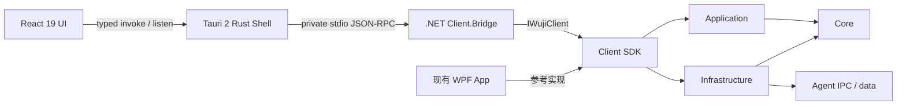
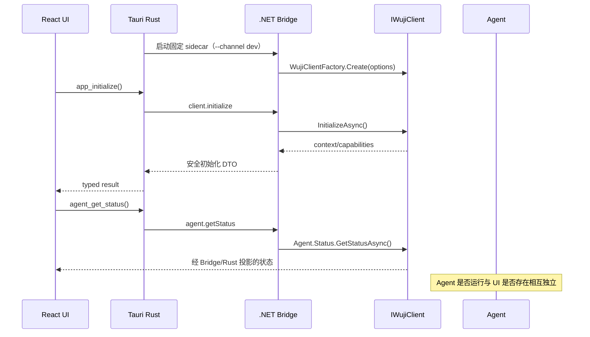

# WUJI Tauri 2 + React 19 前端实施规划

日期：2026-07-16

状态：阶段 0～3 已完成；阶段 4 实施中（4A 合同与 Bridge、4B Rust command 已完成）；阶段 5～8 待实施

目标平台：Windows 10/11

前置成果：Application / Client SDK 抽取阶段 0～7 已完成

关联文档：`docs/design/Application-Client-SDK抽取方案-2026-07-16.md`

## 1. 结论

WUJI 的第一个替代 UI 采用 **Tauri 2 + React 19 + TypeScript**，但不让 Rust、Node.js 或 React 重新实现现有 Windows 数据与 Agent 能力。推荐的目标结构是：

```text
Tauri 2 + React 19 UI
        ↓ 受限、强类型的 Tauri commands / events
Rust Shell
        ↓ 私有 stdio JSON-RPC
.NET Client.Bridge
        ↓ IWujiClient
Application + Client + Core
        ↓
Infrastructure / Agent
```

核心策略是先完成一个最小垂直切片，再逐页迁移：

1. 初始化；
2. Agent 状态与 start/pause/resume/stop；
3. Dashboard overview；
4. Settings get/save；
5. 验证托盘、进程退出、dev/prod channel、打包与安全边界；
6. 通过门禁后再迁移 Timeline、Apps、Insights、Diagnostics、Privacy 等页面。

WPF App 在整个试点期间继续作为稳定参考实现、行为对照和回滚入口。Tauri 前端通过验收并获得明确产品批准前，不替换默认 WPF 启动路径，也不删除 Legacy/Preview 双 Shell。

## 2. 背景与当前基线

Application / Client SDK 抽取完成后，现有依赖边界已经具备替换 UI 的基础：

- `QuantifiedSelf.Windows.Core` 是无 UI 的稳定领域合同；
- `QuantifiedSelf.Windows.Application` 提供数据查询、Agent 编排、设置等用例；
- `QuantifiedSelf.Windows.Client` 通过 `IWujiClient` 组合 Infrastructure、IPC、SQLite、文件、进程和注册表实现；
- WPF App 只直接引用 Application、Client、Core，不再引用 Infrastructure 或 Agent；
- `IWujiClient.DisposeAsync()` 当前不会停止 Agent；
- prod/dev channel 已隔离数据目录、Named Pipe、Agent mutex 和登录启动项；
- 当前发布流程仍只发布 WPF App 和 Agent，并把 Agent 隔离在 `App/Agent/`；
- 阶段 7 基线为 Build 0 warning / 0 error，Architecture 35/35，Fast 114/114，Integration 421/421，Wpf 15/15，Full 560/560。

开始本方案前，应先把 Application / Client SDK 阶段 7 的既有改动作为独立提交收口，避免 Bridge/Tauri 变更与分层测试重构混在同一提交中。

## 3. 目标

本方案要实现：

- 建立可由非 .NET UI 使用的稳定本地 Client Bridge；
- 让 React 只消费安全、版本化、可生成类型的应用合同；
- 保留现有 Agent、SQLite schema、Named Pipe、runtime/control 文件和业务规则；
- 证明 Tauri 窗口退出、Bridge 退出和 Agent 停止互不等价；
- 建立可重复的 dev channel 开发、自动测试、打包和手动验收流程；
- 交付与 WUJI 产品风格一致的中文桌面 UI 基础壳；
- 让后续页面迁移变成按 feature 扩展，而不是再次重构底层；
- 为未来 Electron、其他 WebView Shell 或远程自动化保留稳定的应用合同，但不在本轮同时实现这些宿主。

## 4. 非目标

本方案不包含：

- 重写 Agent、状态机、采样循环或隐私过滤逻辑；
- 修改 SQLite schema、SQL 语义、设置文件、runtime/health/control 文件格式；
- 修改 Agent Named Pipe 协议、命名规则、超时或 file fallback 语义；
- 让 Rust 或 React 直接访问 SQLite、Named Pipe、注册表、runtime 文件或 Agent 可执行文件；
- 在前端复制统计、洞察、显示名解析、状态判断或设置校验规则；
- 第一轮迁移所有 WPF 页面；
- 第一轮替换现有 WPF 发布流程或默认 Shell；
- 引入远程 Web 服务、账户体系、云同步、遥测上传或 CDN 字体；
- 展示尚未有领域模型支持的“稳定工作”“上下文切换”“中断”“30 天趋势”“12 周趋势”等产品语义；
- 为了 Web 技术统一而牺牲 Windows 当前用户隔离、本地优先和离线可用性。

## 5. 架构原则与强制边界

### 5.1 单向依赖



强制规则：

- React 只能调用 Rust 暴露的白名单 Tauri command，不能获得通用 shell、文件系统、SQL 或任意进程执行能力；
- Rust 只能负责桌面 Shell、窗口、托盘、单实例、Bridge 子进程和协议转发，不包含业务查询或业务判断；
- Bridge 只能通过 `IWujiClient`/feature client 执行用例，不直接 new Infrastructure adapter，也不直接访问 SQLite、Named Pipe 或文件；
- Bridge 不直接序列化 Application/Core 对象，必须投影为安全、版本化的 Bridge DTO；
- Application/Core 继续保持无 WPF、WinForms、WebView、Tauri、React、Node 和 Rust 依赖；
- Agent 不引用 Bridge、Tauri 或 React；
- WPF 与 Tauri 使用同一套 Client SDK 行为，差异只能出现在表现层和宿主生命周期层。

### 5.2 本地优先

- 运行时不依赖互联网；
- 不使用在线 Google Fonts，中文字体优先采用 Windows 系统字体栈；
- 前端静态资源全部随 Tauri 包分发；
- 不允许 WebView 导航到远程页面；
- 不新增遥测上传；
- 所有日志默认保存在对应 runtime channel 的本地安全目录，并经过脱敏。

### 5.3 一处业务真相

以下逻辑只能存在于 Core/Application/Client：

- Agent 实际状态、stale/healthy 判定；
- IPC-first/file-fallback；
- 进程定位、启动、优雅停止和 kill fallback；
- Dashboard、应用使用、热力图和洞察计算；
- 设置默认值、范围校验、保存/备份/恢复；
- prod/dev channel 路径、pipe、启动项名称；
- 隐私规则和窗口标题遮罩。

React 只做 DTO 到可见状态的投影、格式化和交互；格式化若影响业务含义，应先进入 Core/Application，而不是在 TypeScript 中复制。

## 6. 目标进程模型与信任边界

### 6.1 进程

| 进程 | 所有者 | 生命周期 | 允许职责 |
|---|---|---|---|
| Tauri UI | 用户桌面会话 | 显示、隐藏、退出 | WebView、窗口、托盘、React UI |
| .NET Bridge | Tauri Rust Shell | 随宿主创建，可崩溃重启 | 托管一个 `IWujiClient`，执行版本化应用命令 |
| Agent | 独立后台进程 | 可早于 UI 启动、晚于 UI 退出 | 采样、持久化、Agent IPC |

### 6.2 生命周期不变量

- 关闭或隐藏窗口不等于退出 Tauri 进程；
- 退出 Tauri 进程会关闭 Bridge，但默认不停止 Agent；
- Bridge 收到 EOF、父进程退出或自身 Dispose 时，只取消请求并调用 `IWujiClient.DisposeAsync()`；
- 只有用户明确执行 `agent.stop` 才请求停止 Agent；
- Agent 已运行时启动 Tauri，不得重复启动 Agent；
- Bridge 崩溃不得影响 Agent；Rust 可以有限重启 Bridge，并在 UI 中显示可恢复错误；
- Tauri 崩溃后再次启动，应重新 initialize、查询 Agent 状态和刷新页面数据；
- Windows 注销/关机时，宿主尽力释放 Bridge，但不能依赖异步 UI 流程保证 Agent 状态变更。

### 6.3 正常启动序列



### 6.4 正常退出序列

1. React 停止轮询并取消尚未完成的前端请求；
2. Rust 停止向 WebView 发事件，不再接收新 command；
3. Rust 请求 Bridge graceful shutdown，并设置短超时；
4. Bridge 取消 in-flight request，等待安全收尾；
5. Bridge 调用 `IWujiClient.DisposeAsync()`；
6. Bridge 退出；超时后 Rust 只终止 Bridge 子进程；
7. Rust 释放托盘和窗口资源后退出；
8. Agent 保持原状态继续运行，除非此前收到明确 stop 命令。

## 7. .NET Client.Bridge 设计

### 7.1 项目位置

建议新增：

```text
src/QuantifiedSelf.Windows.Client.Bridge/
tests/QuantifiedSelf.Windows.Client.Bridge.Tests/
contracts/wuji-bridge/v1/
tools/QuantifiedSelf.Windows.Bridge.ContractGen/   # 如生成器需要独立 .NET tool
```

Bridge 使用 `net8.0-windows10.0.19041` 控制台应用，直接引用 Client、Application 和 Core。不得直接引用 Infrastructure、Agent、App 或任何 UI framework。

### 7.2 传输选择

第一版使用父子进程私有 **stdin/stdout JSON-RPC 2.0 风格协议**：

- 不打开 TCP 端口；
- 不创建第二套对外 Named Pipe；
- Rust 是 Bridge 的唯一父进程和协议对端；
- stdout 只允许输出协议消息，所有日志写 stderr；
- 使用 UTF-8 NDJSON，一行一个完整 JSON 消息；字符串中的换行由 JSON 转义；
- 单条消息设置上限，初始建议 1 MiB；超限立即返回协议错误并保持进程可控；
- 解析失败、未知方法、重复响应和非法 id 均有稳定错误码；
- 每个请求设置取消和超时；长查询不得无限占用 Bridge；
- Bridge 对 side-effect request 保留有限、带过期时间的 requestId 去重记录。

选择 stdio 的原因是它天然限定在父子进程之间，避免新建可被同机其他进程探测的服务端点。以后若必须支持多个宿主共享 Bridge，再单独通过 ADR 评估当前用户 ACL 的 Named Pipe；第一版不预留监听端口。

### 7.3 协议包络

示意请求：

```json
{
  "jsonrpc": "2.0",
  "id": "01J...",
  "method": "agent.getStatus",
  "params": {},
  "meta": {
    "apiVersion": "1.0",
    "correlationId": "01J..."
  }
}
```

成功响应：

```json
{
  "jsonrpc": "2.0",
  "id": "01J...",
  "result": {
    "actualState": "running",
    "isRunning": true,
    "isHealthy": true,
    "isStale": false
  }
}
```

失败响应：

```json
{
  "jsonrpc": "2.0",
  "id": "01J...",
  "error": {
    "code": "agent_unavailable",
    "message": "后台记录服务暂时不可用，请稍后重试。",
    "data": {
      "kind": "transient",
      "retryable": true,
      "correlationId": "01J..."
    }
  }
}
```

协议要求：

- `apiVersion` 使用 major/minor；不兼容变更必须升级 major；
- 未识别的可选字段必须可忽略，删除/改义字段属于不兼容变更；
- 时间统一传 ISO 8601 UTC，前端仅在显示时转换为本地时区；
- duration 使用明确带单位的字段，如 `activeDurationSeconds`；
- enum 使用固定小写字符串，不暴露 C# 数字值；
- 可空字段与缺失字段语义必须在 schema 中区分；
- 不直接把异常类型、stack trace 或任意 `Exception.Message` 返回 UI；
- 诊断 correlation id 可以跨 React、Rust、Bridge 关联，但不能包含用户名、SID、路径或窗口标题。

### 7.4 合同与代码生成

`contracts/wuji-bridge/v1/` 是跨语言协议的唯一来源：

- JSON Schema 描述 request、response、notification、method params/result 和错误；
- 从同一 schema 确定性生成 C#、Rust、TypeScript 类型；
- 生成代码不得手工修改；
- Application/Core 类型由 Bridge mapper 显式映射为协议类型；
- 生成文件可以提交，以便离线构建和审查；
- `contracts:generate` 负责生成；
- `contracts:check` 重新生成并在有 diff 时失败；
- CI/本地门禁校验 schema、示例 payload、序列化快照和三端生成结果；
- 生成器及其版本必须锁定，不允许每台机器得到不同输出。

阶段 1 应用一个小型 spike 确认生成链：C# 可使用锁定版本的 NJsonSchema 工具链，Rust 可使用 `typify` 或等价的固定生成器，TypeScript 可使用 `json-schema-to-typescript`。若其中任一生成器不能稳定、确定性工作，必须在阶段 1 内记录 ADR 并替换工具，不能退回三端手写同义 DTO。

### 7.5 第一版方法集

| Bridge method | `IWujiClient` 入口 | 是否有副作用 | 初始超时建议 |
|---|---|---:|---:|
| `client.initialize` | `InitializeAsync` + `Context` | 是，幂等 | 10s |
| `agent.getStatus` | `Agent.Status.GetStatusAsync` | 否 | 5s |
| `agent.start` | `Agent.Process.StartAgentAsync` | 是 | 15s |
| `agent.pause` | `Agent.Control.RequestPauseAsync` | 是 | 10s |
| `agent.resume` | `Agent.Control.RequestResumeAsync` | 是 | 10s |
| `agent.stop` | Application/Client 的统一停止用例 | 是 | 20s |
| `activity.getOverview` | `Activity.Overview` 的三个查询 | 否 | 10s |
| `settings.get` | `Settings` read methods | 否 | 10s |
| `settings.save` | `Settings` save methods | 是 | 15s |
| `bridge.shutdown` | Bridge host | 是，幂等 | 5s |

`activity.getOverview` 应返回 Dashboard 所需的一次性聚合 DTO，避免 React 为一个页面制造三个串行 round trip。Bridge 可以并发调用彼此独立的 `Overview` 查询，但不得改变 Application 的业务结果。

阶段 2 实施前，WPF ViewModel 会先调用 `StopAgentGracefullyAsync()`，失败后再调用 `KillAgentAsFallbackAsync()`。阶段 2 已将这段编排收口为 `IAgentProcessService.StopAgentAsync()`：WPF 与 Bridge 共同调用统一用例，React/Rust 不复制停止规则；回归测试已冻结超时、fallback 和最终状态语义。

`settings.save` 只接收 schema 中显式列出的字段；未知字段拒绝，所有范围和隐私规则仍调用现有 Core/Application 校验。涉及清空历史、数据修剪、备份恢复或隐私规则批量变更的操作必须保持独立 command，不得混进普通 settings mass assignment。

### 7.6 安全 DTO

第一版 Bridge DTO 不应暴露：

- 绝对路径和 `WujiClient.Paths`；
- Windows SID、用户名、机器名；
- 原始 Named Pipe 名称；
- Agent 可执行文件位置；
- SQLite、日志、runtime/control 文件位置；
- 原始异常、stack trace、SQL、注册表命令值；
- 未遮罩窗口标题；
- `AgentProcessInfo.UserName`、`MachineName` 等不需要 UI 展示的字段。

Agent 状态只返回 UI 必需的结构化状态、健康度、安全时间戳和安全说明。高级诊断后续也必须通过专用安全 DTO 映射，而不是直接序列化 `RuntimeState` 或 `AgentHealthState` 全对象。

## 8. Tauri 2 Rust Shell 设计

### 8.1 职责

Rust Shell 负责：

- 创建窗口、托盘和菜单；
- 单实例与第二实例激活已有窗口；
- 以固定路径、固定参数启动 Bridge sidecar；
- 管理 stdin/stdout、请求表、超时、取消、崩溃检测和有限重启；
- 把 Bridge 结果反序列化成生成的 Rust DTO；
- 向 React 暴露最小白名单 command；
- 把 Agent 状态变更、Bridge 状态变更等通知转换为 Tauri event；
- 控制 dev/prod channel，不接受 React 传入任意路径、可执行文件或 channel；
- 处理 close-to-tray、真正退出和 Bridge shutdown 顺序。

Rust Shell 不负责：

- 查询 SQLite；
- 连接现有 Agent Named Pipe；
- 读取/写入设置或 runtime 文件；
- 定位或启动 Agent；
- 解释 Agent 状态机；
- 计算 Dashboard、图表或洞察；
- 记录原始窗口标题、SID、路径或异常到日志。

### 8.2 Tauri command 白名单

React 侧只看到语义化 command，例如：

```text
app_initialize
agent_get_status
agent_start
agent_pause
agent_resume
agent_stop
activity_get_overview
settings_get
settings_save
app_request_exit
window_hide
window_show
```

不暴露：

- `execute(command, args)`；
- 任意文件读写；
- 任意 URL 打开；
- 任意 sidecar 启动；
- 任意 Bridge method 名字符串转发；
- 任意 channel/dataRoot 参数。

Tauri capability 文件必须逐项允许需要的 command。即使 Rust 内部使用 shell/sidecar 能力，也不把通用 shell plugin capability 授权给 WebView。

### 8.3 Bridge supervisor

Rust 维护单个 `BridgeSupervisor`：

- 启动后完成协议 hello/version negotiation；
- 维护 `requestId -> oneshot responder`；
- stdout 读取循环只接收合法 JSON-RPC；
- stderr 写入经过限制和脱敏的宿主日志；
- 单个请求失败不重启 Bridge；
- EOF、进程退出或协议流损坏时标记 Bridge unavailable；
- 对非致命崩溃最多自动重启一次，使用退避，避免 crash loop；
- 重启后重新 initialize，并通知 React invalidate query cache；
- 连续失败时停止自动重启，向 UI 返回带“重试”操作的安全错误；
- 退出时先拒绝新请求，再 graceful shutdown，最后只在超时后终止 Bridge。

## 9. React 19 前端设计

### 9.1 技术栈

第一版固定为：

- React 19；
- TypeScript strict；
- Vite；
- `pnpm` + lockfile；
- React Router，页面级 lazy import；
- TanStack Query 管理 Bridge 查询、缓存、重试和失效；
- 轻量 UI 状态优先使用组件状态/Context；只有跨页面且与服务端无关的状态需要时才引入 Zustand；
- 从 Bridge schema 生成 TypeScript 类型和运行时校验器；
- Vitest + React Testing Library；
- SVG 图标使用一致的 Phosphor React 图标集，不使用 emoji 作为结构图标；
- 不在第一版引入 Next.js、SSR、Node 后端、远程 API 层或重量级全局状态框架。

依赖版本必须锁定。Node 使用仓库声明的 LTS 版本，pnpm 通过 Corepack 锁定，Rust 使用 `rust-toolchain.toml` 锁定 stable 工具链；升级 Tauri、React、WebView2 相关依赖必须单独提交并通过完整门禁。

### 9.2 建议目录

```text
src/QuantifiedSelf.Windows.Tauri/
├─ package.json
├─ pnpm-lock.yaml
├─ vite.config.ts
├─ tsconfig.json
├─ src/
│  ├─ app/                 # 路由、providers、错误边界
│  ├─ bridge/              # invoke/listen 包装、generated contracts
│  ├─ components/          # 跨 feature 表现组件
│  ├─ design-system/       # tokens、theme、基础组件
│  ├─ features/
│  │  ├─ agent/
│  │  ├─ dashboard/
│  │  └─ settings/
│  ├─ pages/
│  └─ test/
└─ src-tauri/
   ├─ Cargo.toml
   ├─ tauri.conf.json
   ├─ capabilities/
   ├─ icons/
   └─ src/
      ├─ bridge/
      ├─ commands/
      ├─ lifecycle/
      ├─ tray/
      └─ main.rs
```

Bridge 本身保持独立 .NET 项目，不放入 Tauri `src-tauri`，只在开发和打包阶段作为 sidecar 产物复制。

### 9.3 状态模型

状态分三类：

| 状态 | 例子 | 所有者 |
|---|---|---|
| 远端/应用状态 | Agent status、Dashboard、Settings | TanStack Query，通过 Tauri command 获取 |
| UI 会话状态 | 当前路由、展开区、对话框 | React/Router 局部状态 |
| 宿主状态 | Bridge online、窗口/托盘、channel | Rust 为真相，React 订阅安全事件 |

规则：

- 不把 query 结果复制到 Zustand；
- query key 必须包含 feature 与必要参数，但不包含绝对路径；
- Agent 控制 mutation 成功后 invalidate `agent.status`；
- settings save 成功后 invalidate `settings`，失败保留用户输入；
- Bridge 重启后统一 invalidate 受影响 query；
- 默认只对无副作用查询做有限重试；副作用 command 不由前端盲目自动重试；
- 轮询由可见窗口和页面状态控制，窗口隐藏时降低频率或暂停非必要查询；
- 不用 `setInterval` 在多个组件重复轮询 Agent；
- React 19 transition 只用于非紧急可见更新，不掩盖真实保存/控制进度。

### 9.4 页面状态

所有数据页面统一使用：

- `Loading`：超过约 300ms 时显示稳定骨架，避免布局跳动；
- `Empty`：说明没有数据的原因和下一步，不显示空白图表；
- `Ready`：显示数据；
- `Error`：安全中文说明、correlation id（可选折叠）和明确重试操作。

Agent command 还需区分 idle/submitting/succeeded/failed，提交期间禁用冲突命令但不能冻结整个窗口。错误必须出现在相关控制附近，并通过 `aria-live` 或 `role=alert` 通知读屏器。

### 9.5 设计系统

WUJI Tauri UI 延续现有产品原则：local-first、quiet、restrained、data-first、Chinese-first。

- 使用 primitive → semantic → component 三层 token；
- 颜色、字号、间距、圆角、阴影、动效均由 token 管理，不在页面硬编码；
- 同时设计 Light、Dark 和 Windows High Contrast；
- High Contrast 优先使用系统颜色/媒体查询，不能退回普通 Light 主题；
- 中文正文使用本地系统字体栈，不从网络加载 Fira/Google Fonts；技术标识仅在折叠的高级诊断中使用等宽字体；
- 导航使用“图标 + 中文标签”，当前页有清晰非纯颜色标识；
- 文本对比度至少 4.5:1，大型图形/边界至少 3:1；
- 可见 focus ring，Tab 顺序与视觉顺序一致；
- 页面切换后焦点移动到主内容标题；
- 提供跳到主内容的 skip link；
- 尊重 `prefers-reduced-motion`；微交互通常 150～300ms，只使用 transform/opacity，且不能阻塞输入；
- 图表必须有可见图例、精确 tooltip、键盘可达的数据点或等价表格/文本摘要；
- 50 项以上列表评估虚拟化；1000 点以上图表先聚合/采样；
- 页面级 code splitting，避免一次加载全部图表和页面模块；
- 结构图标使用 SVG，不使用 emoji、字体符号或不可主题化位图。

本规划不直接冻结最终色值和视觉稿。实现 Dashboard 前应基于 WUJI 现有主题和产品规范建立专门的 Web design tokens，并通过截图/对比度审查；自动生成的通用“运营 Landing Page”或 Google Fonts 建议不作为产品规范。

### 9.6 第一版信息架构

```text
主 Shell
├─ 顶栏：产品名、dev 标识、Agent 状态与控制、窗口操作
├─ 侧栏
│  ├─ 概览
│  └─ 设置
└─ 主内容
   ├─ Dashboard
   └─ Settings
```

第一版不显示尚未迁移页面的假入口。后续页面就绪时再加入导航；若需要提前展示路线，应使用明确禁用状态和说明，不能让用户进入空壳页面。

## 10. dev/prod channel 策略

### 10.1 试点期

阶段 0～7 的运行验证一律使用 `dev` channel：

- Tauri dev 配置固定启动 Bridge `--channel dev`；
- Bridge 使用 `WujiClientOptions.ChannelName = "dev"`；
- Rust 不接受 React 传入 channel 或 data root；
- UI 顶栏持续显示清晰但克制的“开发通道”标识；
- 测试使用唯一临时 data root/channel，不共享真实 dev/prod 状态；
- 不读取、不复制、不迁移生产数据库；
- 不创建生产 Run Key；
- 手动测试不执行生产清理、隐私或维护动作。

### 10.2 production gate

只有阶段 7 全部通过并获得明确产品批准，才允许新增 production Tauri 配置。production 配置必须：

- 固定 `prod` channel，不能由前端切换；
- 经过签名与安装器验证；
- 验证与 WPF 使用同一 prod 数据时不会并发执行破坏性操作；
- 验证单实例、托盘、自启和升级；
- 明确 WPF/Tauri 谁是默认登录启动宿主，不能同时注册两个默认启动项；
- 提供完整回滚到 WPF 的路径。

## 11. 安全与隐私

### 11.1 WebView/Tauri

- CSP 默认 `default-src 'self'`，按实际构建最小化放行；
- 禁止远程脚本、`eval`、任意 iframe 和远程导航；
- Tauri command 和 capability 使用最小白名单；
- 禁止 WebView 直接使用 shell、fs、process、SQL、HTTP 等通用能力；
- 外部链接如后续确需打开，必须通过专用 allowlisted command 校验 scheme/host；
- 开发工具只在 dev build 启用，release 默认关闭；
- 前端依赖执行 lockfile、license 和漏洞审查；
- Rust/.NET sidecar 路径由打包清单确定，不接受 UI 输入；
- Bridge 可执行文件及资源在安装/启动时验证存在，正式发布加入签名校验策略。

### 11.2 数据最小化

- Dashboard 默认不返回窗口标题；
- Settings DTO 只包含 UI 当前可编辑字段；
- Agent 状态不返回 SID、用户名、机器名或路径；
- 错误消息使用 allowlist 映射，不把 raw exception 穿透到 UI；
- 日志字段按 schema 允许列表记录；
- correlation id 随机生成，不编码用户信息；
- React 不把业务数据写入 localStorage；只允许保存无敏感性的 UI 偏好，且优先走 Settings 用例；
- 剪贴板、导出、清空历史等能力后续按独立威胁模型和确认流程实施。

### 11.3 威胁模型必须覆盖

- 恶意/受污染 WebView 内容调用高权限 command；
- Bridge sidecar 被替换；
- stdout 协议注入或超大 payload；
- 重放 side-effect request；
- 错误、日志和 diagnostics 泄露路径/SID/窗口标题；
- dev/prod channel 串线；
- Tauri 与 WPF 同时操作 Agent/设置；
- Bridge crash loop、孤儿进程和退出超时；
- 安装器升级后 sidecar/Agent 版本不匹配。

阶段 7 发布前必须形成简短 threat model 记录，并把高风险项转为自动门禁或手动验收项。

## 12. 可观测性与错误模型

### 12.1 日志分层

- React：只记录 UI event category、command 名、耗时、结果类别和 correlation id；
- Rust：记录 Bridge 启停、协议健康、超时、重启和窗口生命周期；
- Bridge：记录方法、耗时、Client 结果类别和安全错误码；
- Agent：沿用现有日志；
- stdout 永远不写 Bridge 日志；
- 所有层禁止记录完整 settings、窗口标题、SID、用户名、机器名、绝对路径或 raw exception；
- release 默认不输出 debug payload；
- 日志滚动与保留沿用本地产品策略，不新增上传。

### 12.2 稳定错误分类

建议错误类别：

| kind | 含义 | UI 策略 |
|---|---|---|
| `validation` | 输入无效 | 定位字段并保留输入 |
| `transient` | 暂时不可用/超时 | 显示重试，不自动重试副作用 |
| `conflict` | 状态已变化/命令冲突 | 刷新状态并解释 |
| `not_found` | 资源或 Agent 不存在 | 提供启动/修复动作 |
| `unsupported` | 版本/能力不支持 | 阻止继续并提示升级 |
| `internal` | 未分类安全错误 | 通用说明 + correlation id |

前端只根据 `kind`、稳定 `code` 和 `retryable` 决策，不解析中文 message 文本。

## 13. 测试策略

### 13.1 测试金字塔

```text
少量：打包安装 + 真实 Windows/Tauri/Agent 手动验收
中量：Tauri Rust ↔ Bridge 进程集成、Bridge ↔ IWujiClient 集成
大量：Bridge mapper/协议、Rust supervisor、React feature/component 单元测试
持续：现有 .NET 分层测试与架构门禁
```

### 13.2 .NET Bridge 测试

- ProjectReference 只允许 Client/Application/Core；
- assembly 不引用 WPF/WinForms/Tauri/WebView；
- initialize 幂等；
- 每个 method 正确调用对应 feature client；
- Application/Core → Bridge DTO 映射完整；
- 敏感字段永远不进入 JSON；
- 未知方法、非法 JSON、超限 payload、重复 id、EOF；
- request cancellation/timeout；
- side-effect requestId 去重；
- stdout 只有协议，日志只走 stderr；
- Dispose/shutdown 不调用 Agent stop；
- dev/prod/custom channel 参数映射；
- schema serialization golden tests。

### 13.3 Rust 测试

- command 白名单和参数校验；
- Bridge 启动参数固定，React 不能覆盖；
- hello/version negotiation；
- 并发 request 匹配 response；
- timeout、取消、EOF、非法响应和 crash；
- 有限重启和 crash-loop 熔断；
- exit 顺序不发送 agent.stop；
- close-to-tray 不关闭 Bridge；
- 真正退出回收 Bridge，不产生孤儿进程；
- Tauri capability 不暴露 shell/fs/http 通用能力。

### 13.4 React 测试

- generated contract 边界校验；
- Loading/Empty/Ready/Error 四态；
- Agent 状态与按钮可用性；
- mutation 期间冲突操作禁用；
- Dashboard 格式化、空数据和错误恢复；
- Settings 初值、字段校验、保存成功/失败和保留输入；
- 路由返回后的状态保持；
- ErrorBoundary；
- 键盘导航、focus 恢复、aria label/role/live region；
- Light/Dark/High Contrast token 切换；
- reduced motion；
- 关键页面 axe 自动审查；
- route-level chunk 和 bundle budget。

### 13.5 进程与端到端测试

- 用 fake Bridge 验证 Rust/React 协议和错误场景；
- 用 fake `IWujiClient` 验证 Bridge 协议；
- 用真实 Bridge + dev Client 验证 initialize、Agent 状态和 Dashboard；
- 用唯一临时 channel/data root，避免并行测试互相污染；
- 真实 Agent 生命周期测试标记 Integration，不能使用固定 sleep 作为同步；
- 打包 smoke 验证 Tauri、Bridge、Agent 三个产物的相对位置；
- 现有 solution 全量测试持续执行，不能因新增前端跳过 WPF 回归。

### 13.6 建议验证命令

命令在各阶段建立后逐步加入：

```powershell
dotnet build .\QuantifiedSelf.Windows.sln -c Release
dotnet test .\QuantifiedSelf.Windows.sln

pnpm --dir .\src\QuantifiedSelf.Windows.Tauri install --frozen-lockfile
pnpm --dir .\src\QuantifiedSelf.Windows.Tauri contracts:check
pnpm --dir .\src\QuantifiedSelf.Windows.Tauri lint
pnpm --dir .\src\QuantifiedSelf.Windows.Tauri typecheck
pnpm --dir .\src\QuantifiedSelf.Windows.Tauri test

cargo fmt --check --manifest-path .\src\QuantifiedSelf.Windows.Tauri\src-tauri\Cargo.toml
cargo clippy --manifest-path .\src\QuantifiedSelf.Windows.Tauri\src-tauri\Cargo.toml -- -D warnings
cargo test --manifest-path .\src\QuantifiedSelf.Windows.Tauri\src-tauri\Cargo.toml
```

最终命令以实际脚本为准，但必须保留 build、contract drift、lint、typecheck、unit、integration 和 full suite 六类门禁。

## 14. 打包与发布策略

### 14.1 目标产物布局

逻辑布局：

```text
WUJI Tauri/
├─ WUJI.exe                         # Tauri host
├─ Client.Bridge/
│  └─ QuantifiedSelf.Windows.Client.Bridge.exe
└─ Agent/
   └─ QuantifiedSelf.Windows.Agent.exe
```

实际 Tauri sidecar 文件名可能包含 target triple，最终以 Tauri 2 bundler 约定为准，但逻辑上必须保持 Bridge 和 Agent 依赖目录隔离，不能把多个 self-contained .NET 输出平铺到应用根目录。

### 14.2 分步策略

- 阶段 0～6 不修改现有 `publish/scripts/publish.ps1` 语义；
- 开发期使用独立脚本发布 Bridge 并复制到 Tauri sidecar/resource 目录；
- 阶段 7 新增独立 `publish-tauri.ps1` 或等价入口；
- 原 WPF publish 继续可独立执行；
- Tauri 发布依次构建 React、Rust、Bridge、Agent，再组装并验证；
- Bridge/Agent 初期均采用 self-contained win-x64，避免目标机要求预装 .NET；
- 验证 WebView2 runtime 策略、Windows 10 最低版本和离线安装；
- 正式发布必须签名 Tauri host、Bridge、Agent 和安装器；
- 生成版本清单，记录 UI/Bridge/Client/Agent/protocol 版本；
- 安装器升级必须验证不会删除用户数据，也不会把 dev 数据迁入 prod；
- 输出 SBOM、第三方许可和依赖漏洞审查结果；
- 保留 WPF 稳定安装包作为回滚渠道。

## 15. 分阶段实施计划

每个阶段都必须独立可构建、可测试、可提交、可回滚。每阶段完成后在 `docs/devlog/` 新增中文完成说明，记录范围、关键决策、测试结果、未修改边界和下一阶段。

### 阶段 0：ADR、基线与安全边界

实施状态：已完成（2026-07-16），详见 `docs/design/ADR-001-Tauri2-React19-Bridge边界-2026-07-16.md` 和 `docs/devlog/Tauri2-React19阶段0-1完成说明-2026-07-16.md`。

目标：在新增运行时代码前冻结行为、工具链和协议决策。

任务：

- 将 Application / Client SDK 阶段 7 既有改动独立提交；
- 记录当前 .NET build、Architecture、Fast、Integration、Wpf、Full 结果；
- 新增 ADR：Tauri 2 + React 19、stdio Bridge、schema-first contract、三进程生命周期；
- 固定 Node LTS、pnpm、Rust stable、Tauri 2、React 19 的版本策略；
- 清点 `IWujiClient` 第一版方法和 DTO 字段；
- 建立敏感字段 denylist 和安全错误码表；
- 建立 dev-only 运行约束和 production promotion gate；
- 建立 Bridge/Tauri 项目引用架构测试占位；
- 记录 WPF 对照 smoke：initialize、Agent 控制、Dashboard、Settings、托盘退出；
- 不创建正式 Tauri 发布包，不访问 prod 数据。

退出条件：

- ADR 评审完成；
- 基线可重复；
- 第一版 methods/DTO/error/lifecycle 清单无未决关键项；
- 阶段 7 与阶段 0 变更可独立回滚。

### 阶段 1：Bridge skeleton 与合同生成

实施状态：已完成（2026-07-16），详见 `docs/devlog/Tauri2-React19阶段0-1完成说明-2026-07-16.md`。

目标：建立无 UI 的最小 Bridge，只打通 initialize。

任务：

- 创建 `Client.Bridge` 和测试项目并加入 solution；
- 建立 schema 目录、版本包络、错误模型和 hello negotiation；
- 建立 C#/Rust/TypeScript 合同生成与 drift check；Rust/TS 可以先生成到 staging 目录，阶段 3 再接入正式宿主；
- 实现 stdin/stdout reader/writer、消息上限、stderr 日志和 shutdown；
- 托管一个 `IWujiClient`；
- 实现 `client.initialize` 和 `bridge.shutdown`；
- 明确 channel 只来自 Bridge 启动参数；
- 增加非法 JSON、未知 method、超时、取消、EOF、stdout purity 测试；
- 增加 Bridge 无 Infrastructure/Agent/App/WPF 引用门禁；
- 验证 Dispose 不停止 Agent。

退出条件：

- 可从 PowerShell/测试宿主启动 Bridge 并完成 hello/initialize/shutdown；
- 三端类型可从单一 schema 确定性生成；
- contract drift 会使测试失败；
- 完整 .NET suite 通过，既有 IPC/数据库/发布行为不变。

### 阶段 2：Bridge Agent 生命周期切片

目标：通过 Bridge 完成 Agent status/start/pause/resume/stop。

实施状态（2026-07-16）：已完成。代码、合同、真实 Bridge dev status smoke 与自动门禁均已通过；WPF dev GUI 对照 smoke 已由人工确认通过，包括 Agent 完整生命周期、Dashboard、Settings、托盘退出、UI/Agent 生命周期独立和 dev/prod 隔离。详见 `docs/devlog/Tauri2-React19阶段2完成说明-2026-07-16.md`。

任务：

- 定义安全 AgentStatus/CommandResult DTO；
- 实现五个 Agent method 和显式 mapper；
- 先把 WPF 现有 graceful stop → kill fallback 编排收口为 Application/Client 统一停止用例，WPF 与 Bridge 共同消费；
- 沿用 Client 的 IPC-first/file-fallback、timeout 和 requestId 语义；
- side-effect request 去重，禁止上层盲目自动重试；
- 覆盖 Agent 未运行、正常运行、paused、stale、IPC timeout、fallback、重复请求和 stop；
- 覆盖 Bridge 在 Agent 运行时退出，Agent 继续运行；
- 覆盖 Agent 不运行时 Bridge 正常启动；
- 使用 dev/唯一测试 channel。

退出条件：

- 命令结果与 WPF/Client 对照一致；
- Bridge JSON 无敏感字段；
- Bridge crash/exit 不停止 Agent；
- Architecture、Integration 和 full suite 通过。

### 阶段 3：Tauri 2 + React 19 基础 Shell

目标：建立可启动的 dev-only Tauri 桌面壳并接入 initialize/Agent。

实施状态（2026-07-16）：已完成。React 19/Vite/Tauri 2 工具链、BridgeSupervisor、固定 dev sidecar、语义 command 白名单、CSP/capability 门禁、Dashboard/Settings 占位路由、Agent 顶栏控制、断线恢复事件和三端自动测试均已落地；Tauri release 无打包构建与人工 dev smoke 已通过。详见 `docs/devlog/Tauri2-React19阶段3完成说明-2026-07-16.md`。

任务：

- scaffold Tauri 2、React 19、TypeScript、Vite、pnpm；
- 锁定 Node/Rust/pnpm 版本与 lockfiles；
- 接入生成的 Rust/TypeScript contracts；
- 实现 BridgeSupervisor、固定 sidecar 启动和 hello/version negotiation；
- 实现 Tauri command 白名单；
- 建立 TanStack Query、Router、ErrorBoundary 和基础 providers；
- 建立语义 design tokens、Light/Dark/High Contrast 骨架；
- 实现主 Shell、Dashboard/Settings 路由占位和 Agent 顶栏控制；
- 固定 `--channel dev`，展示开发通道标识；
- 增加 capability/CSP/远程导航门禁；
- 增加 React、Rust 单元测试和 fake Bridge 集成测试。

退出条件：

- Tauri dev 启动后可 initialize 并控制 dev Agent；
- React 不拥有 shell/fs/sql/http 通用能力；
- keyboard-only 可完成主导航和 Agent 控制；
- Bridge 断开时 UI 显示可恢复 Error 状态；
- .NET、Rust、TypeScript 全部门禁通过。

### 阶段 4：Dashboard 垂直切片

目标：以一个真实数据页验证完整链路和 UI 状态模型。

实施状态（2026-07-16）：4A 合同与 Bridge、4B Rust command 已完成。`activity.getOverview`、安全 Dashboard DTO、C#/Rust/TypeScript 生成物、`IWujiClient.Activity.Overview` 并行聚合、安全映射和隐私门禁均已落地；Rust 已增加 `activity_get_overview` typed pass-through、12 秒外层只读 timeout，React command 白名单和 Bridge ready 后 Overview query 失效规则也已建立。React Dashboard 四态和真实数据显示尚未实施。详见 `docs/devlog/Tauri2-React19阶段4A完成说明-2026-07-16.md`、`docs/devlog/Tauri2-React19阶段4B完成说明-2026-07-16.md`。

任务：

- 扩展 schema 和 `activity.getOverview`；
- Bridge 调用 `IWujiClient.Activity.Overview` 并投影安全 DTO；
- 适度并行获取 summary/top apps/recent sessions；
- React 实现 Dashboard Loading/Empty/Ready/Error；
- 复用现有 WPF 数据语义和中文文案，不在 TS 重算；
- 建立 locale-aware 时间和 duration 显示；
- 建立可访问图表/列表、图例、tooltip 和文本/表格替代；
- 路由级拆包，设置首屏 bundle budget；
- 与 WPF 同一 dev 数据快照做 parity 测试；
- 验证窗口隐藏后降低非必要刷新。

退出条件：

- 同一数据下 Tauri/WPF 关键指标一致；
- 四态、重试、键盘、读屏和 reduced-motion 通过；
- 无原始窗口标题、路径等隐私数据泄露；
- Dashboard 不直接访问任何底层存储。

### 阶段 5：Settings 垂直切片

目标：验证读取、编辑、校验、保存和状态失效完整链路。

任务：

- 扩展 settings schema，只列出已批准可编辑字段；
- Bridge 显式映射 AppSettings/WindowsAgentOptions；
- 继续使用 Core/Application 默认值与校验；
- 区分普通保存、需要 Agent reload 的保存和危险维护操作；
- React 实现分组表单、显式 label、helper text、字段级错误和保存反馈；
- 保存失败保留用户输入，成功后刷新 query；
- 未保存修改关闭/导航时确认；
- Light/Dark/High Contrast 下验证控件状态；
- 与 WPF 做设置文件 round-trip parity；
- 禁止 Settings DTO 暴露路径或通用 JSON 编辑入口。

退出条件：

- 读取/保存结果与 WPF 一致；
- 无效值不会写入；
- 失败可恢复且不丢输入；
- dev/prod 设置完全隔离；
- Agent reload/fallback 行为无回归。

### 阶段 6：托盘、生命周期、单实例与 channel 收口

目标：验证 Tauri 作为真实 Windows 桌面宿主的长期运行行为。

任务：

- 实现 minimize-to-tray、close-to-tray 和真正退出；
- 实现托盘状态、显示/隐藏、Agent 控制和退出菜单；
- 实现单实例，第二实例只激活已有窗口；
- 实现 Bridge graceful shutdown、超时终止和孤儿进程检测；
- 实现 Bridge crash 后一次有限重启、query invalidation 和 crash-loop 熔断；
- 验证 Tauri 退出不停止 Agent；
- 验证明确 stop 后 Agent 停止；
- 验证 Agent 已运行/未运行/paused/stale 下冷启动；
- 验证隐藏启动和无 Window Loaded 情况；
- 固化 dev channel；设计但不启用 prod 登录自启切换；
- 记录与 WPF CloseToTray/MinimizeToTray 的差异和兼容策略。

退出条件：

- 无孤儿 Bridge；
- Agent 生命周期不依赖窗口或 Bridge；
- 单实例和托盘行为稳定；
- dev 数据、pipe、mutex、启动项无 prod 串线；
- 24 小时 dev soak 无持续内存/句柄增长或刷新风暴。

### 阶段 7：打包、安全与完整验收

目标：产出可安装的 dev/preview 包，并判断是否具备 production 试点资格。

任务：

- 新增独立 Tauri publish 脚本，不破坏 WPF publish；
- 发布 React/Tauri、self-contained Bridge、self-contained Agent；
- 保持 Bridge/Agent 隔离目录；
- 验证 target-triple sidecar 命名和 bundler resource；
- 建立安装/卸载/覆盖升级/降级/修复测试；
- 校验 Windows 10/11、WebView2 runtime 和离线安装；
- 完成 CSP/capability、依赖、license、SBOM 和 threat model 审查；
- 正式候选包执行签名验证；
- 建立版本兼容矩阵和不匹配错误；
- 执行尺寸、DPI、Light/Dark/High Contrast、键盘、读屏验收；
- 执行 Bridge crash、Agent crash、IPC fallback、断电式退出恢复；
- 与 WPF 进行行为/数据 parity 记录；
- 形成是否进入 production preview 的 go/no-go 评审。

退出条件：

- 安装包可在干净 Windows 环境离线运行；
- 所有自动门禁通过，build 0 error / 0 new warning；
- 无未解决 P0/P1 安全、数据或生命周期问题；
- 手动验收无未解决 P0；
- WPF 稳定包和回滚说明仍可用；
- 未经明确批准，不注册 prod 登录启动，也不替换默认 WPF。

### 阶段 8：后续页面迁移与 promotion gate

目标：按业务价值逐页替换，而不是一次性重写。

建议顺序：

1. Diagnostics：先建立安全诊断 DTO 和修复操作；
2. Apps：复用 Activity Apps 用例；
3. Timeline/Sessions：处理大列表、日期/小时导航和虚拟化；
4. Privacy：单独威胁模型、遮罩、确认和敏感操作测试；
5. Insights/Heatmap：最后迁移复杂图表、键盘网格和数据语义；
6. Startup/更新/高级维护：在 installer 与宿主责任稳定后实施。

每个页面都重复以下闭环：contract → Bridge mapper → Rust command → React query/UI → parity → accessibility → privacy → docs。

只有满足以下条件，才讨论把 Tauri 提升为默认 UI：

- 目标功能覆盖达到产品批准范围；
- WPF/Tauri 数据与命令 parity 通过；
- 960×640、1280×800 和更宽尺寸通过；
- 100%、125%、150%、200% DPI 通过；
- Light、Dark、Windows High Contrast 通过；
- keyboard-only、屏幕阅读器、可见焦点、reduced motion 通过；
- 托盘、自启、升级、回滚、签名和隐私审查通过；
- 完整自动测试长期稳定；
- 有明确产品批准和迁移/回退公告。

在 promotion 前不得删除 WPF、不得改变默认 shell gate、不得把 prod 用户强制迁移到 Tauri。

## 16. 各阶段提交与完成记录

建议每阶段至少拆为以下逻辑提交，均使用中文 `git commit -m`：

1. 合同/架构门禁；
2. 运行时实现；
3. 测试与修复；
4. 文档/完成说明。

不要把依赖升级、生成文件、Bridge 行为、UI 视觉和发布脚本全部混为一个提交。每阶段完成说明至少记录：

- 本阶段目标和实际范围；
- 新增/修改项目与依赖方向；
- 协议/DTO 变化和版本；
- 生命周期与隐私不变量；
- 自动测试命令、数量和结果；
- 手动 smoke 环境和结果；
- 未修改边界；
- 已知风险、遗留项和下一阶段入口。

## 17. 风险与控制措施

| 风险 | 影响 | 控制措施 |
|---|---|---|
| React/Rust 重复业务规则 | WPF/Tauri 结果漂移 | 所有用例经过 IWujiClient，逐页 parity |
| 三端手写 DTO | 字段和 enum 漂移 | 单一 JSON Schema + 确定性代码生成 + drift gate |
| Bridge 直接序列化 Core 对象 | 敏感字段或内部结构泄露 | 显式安全 DTO mapper + JSON denylist tests |
| 通用 Tauri capability 过宽 | WebView 获得高权限 | 最小 command 白名单，禁止 shell/fs/sql/http |
| Bridge 退出误停 Agent | 后台采集中断 | Dispose/Stop 分离测试，退出序列门禁 |
| Bridge crash loop | CPU/日志风暴 | 有限重启、退避、熔断、可恢复 UI |
| stdout 被日志污染 | 协议流损坏 | stdout purity 测试，日志只写 stderr |
| side-effect 自动重试 | 重复启动/停止/保存 | requestId 去重，前端不盲目 retry mutation |
| dev/prod 串线 | 生产数据风险 | Shell 固定 channel，React 无 channel/path 权限 |
| Tauri/WPF 同时注册自启 | 重复宿主和竞态 | production gate 明确唯一默认宿主 |
| 打包平铺 .NET 依赖 | DLL 冲突/找不到 Agent | Bridge/Agent 独立目录和 publish layout tests |
| WebView2/依赖升级 | 兼容或供应链风险 | 锁版本、独立升级提交、SBOM/漏洞审查 |
| 图表/大列表卡顿 | UI 无响应 | route split、虚拟化、聚合、16ms 主线程预算 |
| 无障碍后补成本高 | 页面需返工 | 从 Shell 阶段建立 token/focus/aria/HC 门禁 |
| 过早全量迁移页面 | 风险无法定位 | 先四项 vertical slice，再逐页扩展 |

## 18. 回滚策略

- 阶段 0～2 只新增 Bridge，不改变 WPF 默认路径；删除/禁用 Bridge 即可回滚；
- 阶段 3～6 Tauri 只运行 dev channel，不触碰 prod 数据；回滚为停止 Tauri 并继续 WPF；
- 阶段 7 的 Tauri publish 使用独立脚本，原 WPF publish 保持可用；
- production preview 若出现问题，停止分发/撤销 Tauri 登录启动，恢复 WPF 为唯一默认宿主；
- 不回滚或降级用户数据库 schema，因为本方案不修改 schema；
- Agent 与 Client 协议保持兼容，因此回滚 UI 不要求迁移 Agent 数据；
- 安装器必须支持保留用户数据的卸载/回装；
- 任何阶段出现 prod/dev 串线、隐私泄露、误停 Agent 或不可恢复设置损坏，立即停止该阶段并回滚，不以 UI 完成度抵消数据风险。

## 19. 总体验收定义

本方案只有满足以下全部条件才算完成：

- Tauri + React 能通过 Bridge 完成 initialize、Agent 控制、Dashboard 和 Settings；
- React/Rust 不直接访问 SQLite、Named Pipe、文件、注册表或 Agent executable；
- Bridge 只通过 `IWujiClient` 执行业务用例；
- 合同从单一 schema 生成，三端无手工重复 DTO；
- Bridge、Tauri 和 Agent 生命周期相互独立；
- Tauri/Bridge 退出默认不停止 Agent；
- dev/prod channel 隔离可自动证明；
- 错误、日志和 DTO 不泄露路径、SID、用户名、机器名、原始异常或未遮罩标题；
- WPF 与 Tauri 关键行为和数据一致；
- .NET、Rust、TypeScript、contract、integration、package 全部门禁通过；
- 安装、升级、签名、离线运行和回滚路径经过验证；
- UI 满足中文优先、三主题、键盘、读屏、对比度和 reduced-motion 要求；
- WPF 稳定实现一直保留到 promotion gate 获得明确批准。

## 20. 当前批次完成情况与下一步

阶段 0～3、阶段 4A 与阶段 4B 的实现和自动门禁已于 2026-07-16 完成：

1. Bridge skeleton、schema-first 三端合同和 dev-only 边界已经建立；
2. Application/Client 已提供统一 Agent stop 用例，WPF 和 Bridge 不再各自编排 kill fallback；
3. `agent.getStatus/start/pause/resume/stop` 已通过 `IWujiClient` 打通；
4. 安全 AgentStatus/CommandResult、显式 mapper、方法级 timeout 和带 TTL 的 request id 去重已实现；
5. shutdown、EOF、异常和 Dispose 不停止 Agent，side-effect timeout 不允许上层盲目重试；
6. 真实 Bridge dev status smoke、合同漂移、架构、WPF、Integration 和 607 项 full suite 已通过；
7. React 19 + TypeScript strict + Vite 与 Tauri 2 dev-only Shell 已建立，Node/pnpm/Rust/Cargo/npm 依赖均已锁定；
8. Rust BridgeSupervisor 固定启动 `--channel dev` sidecar，完成 hello/initialize、request responder、timeout、一次自动重启、连续失败熔断、手动恢复和只关闭 Bridge 的 shutdown；
9. WebView 只拥有八个语义 command，CSP 禁止远程脚本、iframe、对象和 eval，capability 不授予 shell/fs/http/sql/process；
10. React 已建立 Router、TanStack Query、ErrorBoundary、Dashboard/Settings 占位路由、Agent 顶栏、dev 标识、键盘导航、三主题 token、reduced-motion 和断线恢复；
11. Tauri release 无打包构建、真实 dev initialize/Agent 控制、合同漂移、React/Rust/.NET 架构与 617 项 full suite 均通过；
12. 阶段 3 详细结果见 `docs/devlog/Tauri2-React19阶段3完成说明-2026-07-16.md`；
13. `activity.getOverview`、安全 Dashboard DTO、三查询并行聚合和隐私映射已在 Bridge 完成；
14. 阶段 4A 合同漂移、TypeScript、Rust、Bridge 37 项测试、622 项 full suite 与 Release build 均通过，详见 `docs/devlog/Tauri2-React19阶段4A完成说明-2026-07-16.md`。
15. Rust `activity_get_overview` 仅 typed forward 生成 DTO，使用 12 秒外层只读 timeout，不计算时长、排名或状态语义；
16. React 固定 command 白名单已加入 Overview，并在 Bridge ready 或手动重连后使 Dashboard Overview query 失效；
17. 阶段 4B React typecheck/lint/9 项测试、Rust 8 项测试/Clippy 和 12 项 Tauri 架构测试通过，详见 `docs/devlog/Tauri2-React19阶段4B完成说明-2026-07-16.md`。

下一批执行 **阶段 4C：React Dashboard**，接入 Overview query，完成 Loading/Empty/Ready/Error、重试、locale-aware 显示、可访问列表/图表和 dev 数据 parity。继续不修改现有 WPF 默认 Shell、IPC、SQLite、Agent 状态机或 WPF 发布流程。
